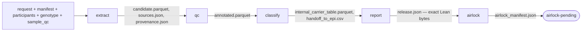
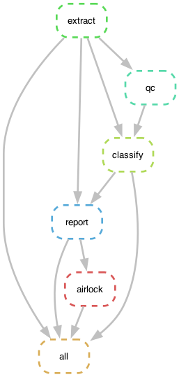

# TRE Release Airlock — formal methods before egress

A proof-of-concept **TRE release airlock** in which an executable **Lean 4** component makes the
final pre-egress release decision. A release candidate (one closed aggregate type) is evaluated
under an independently supplied policy using a decidable formal predicate; a successful runtime
branch constructs a proof-indexed `AirlockExport`, and **only the canonical representation emitted
from that authorised object may be written as the releasable artefact**
(`airlock_pending/release.json`). Rejected candidates produce **no** release artefact. The
surrounding analysis pipeline proposes candidates; it does not hold final release authority.

The worked producer example is a synthetic, governed **recall-by-genotype feasibility service**
that turns *published variant-availability signals* plus *synthetic, TRE-shaped data* into an
**airlock-ready go / no-go decision**. It answers one concrete question — *"is there a governable,
recallable carrier pool for this request?"* — and keeps **four service boundaries explicit**:

1. **Service feasibility** — go / no-go / go-with-caveats, within the turnaround.
2. **Genetic identifiability** — is the variant in the array / imputed resource? Computed from OFH's
   *published* CPRA lists, with SHA-256 provenance.
3. **Epidemiology eligibility** — the post-phenotype count, a separate signed return from epi (downstream).
4. **Final governed release** — exactly **one** client-facing aggregate, SDC-applied, adjudicated by
   the runtime Lean airlock.

**Two things to take away:**
- It is **fail-closed at the release boundary** — the release decision is made at runtime by the
  Lean airlock; refusal cannot construct the export object, so no releasable bytes exist.
- It emits **exactly one client-facing aggregate** and **structurally prevents widening disclosure** —
  participant-level data is kept internal by construction.

## The formal release boundary

```text
untrusted analysis ──▶ ReleaseCandidate ─┐
                                         ├─▶ Lean 4 runtime airlock
trusted Policy Γ (platform record) ──────┘      Policy.Valid Γ ∧ ReleaseOK Γ c
                                                       │ proof h
                                                 AirlockExport
                                                       │ canonical renderer
                                              exact release bytes
                                                       │ mechanical Python bridge
                                        airlock_pending/release.json
```

For this one closed aggregate type, under the platform-authorised policy, the completed system
establishes two distinct guarantees. **Formal (Lean-checked):** the runtime checks the release
predicate over a **value-closed release language** — breakdown labels are a finite inductive
vocabulary, the subject is a parsed CPRA reference, counts and cardinalities are bounded, and
the released representation carries **no free-form string field** (v2 removed `study_id`
entirely; study identity stays in internal evidence) — so neither prose nor identifier-shaped
text can inhabit the released payload; the residual representational capacity (the numerical
values and CPRA components themselves) is stated, not hidden. Success is represented by a
proof-carrying `AirlockExport`; refusal cannot construct one, so no canonical bytes exist;
malformed or out-of-language inputs fail closed.
**Effect-binding (operational):** the trusted policy Γ is a platform-owned deployment record
(`platform/release_policy.json`) — the analysis config, the candidate, and the environment
cannot select or alter it; one platform-bound, digest-attested executable adjudicates (with an
optional mandatory digest pin in the policy record); publication is a committed-generation
transaction — a refused or failed attempt leaves no committed generation, and a successful one
atomically publishes the exact emitted bytes under a `release.ready` receipt binding
policy → request → executable → payload digests; `ofh-feasibility audit verify` verifies the artefacts against
the receipt, requires the complete receipt to equal the Merkle-ledger-bound decision record,
checks the platform policy record still matches, and replays the attested adjudicator over the
retained request preimage. **Distribution:** the supported form is the source checkout (plus
`make airlock` and the platform record) — no standalone wheel is published, because a pure-Python
wheel cannot carry the native adjudicator or the platform policy. The effect-binding half is disciplined, statically-guarded, tested Python — the
platform trust root, attested but not Lean-proved; in production it belongs in a separate
platform-owned process. Build the adjudicator with `make airlock`; protocol + TCB:
[`formal/AIRLOCK_RUNTIME.md`](formal/AIRLOCK_RUNTIME.md).

It does **not** establish: the scientific correctness of upstream counts; that Python `apply_sdc`
correctly derived the candidate; resistance to numerical steganography within the released
aggregates; safety of arbitrary spreadsheets, plots, models, or notebooks; protection against
differencing across separate releases; correctness of the surrounding TRE or operating
environment; or the elimination of human output review. Honesty note: the airlock binary is a
proposed **platform-level** TRE component, not an analyst package — package allowlists (e.g.
OFH's `tre-package-access`) govern analyst-installable Python packages and do not cover it.

> **Independence note:** this is an independent demonstration project by Chey Loveday. It is not
> affiliated with, produced by, or endorsed by Our Future Health; OFH facts used here come from
> OFH's public documentation and are labelled as such.

```bash
make install && make airlock && make demo    # install -> build the Lean adjudicator -> run
```
(`make airlock` needs the Lean toolchain: `curl -fsSL https://elan.lean-lang.org/elan-init.sh | sh`.)

**Scope basis:** this uses **OFH-shaped file formats**, **published variant-availability artifacts**,
and **TRE-style governance constraints**, while the cohort stays **synthetic**. Verified facts,
synthetic stand-ins, and implementation choices are labelled separately (`docs/reference/missing-data.md`,
[`docs/reference/BAG3_VERIFICATION.md`](docs/reference/BAG3_VERIFICATION.md), the identifiability provenance). The wider public data-estate snapshot and
suggested upstream intake shape are captured in
[`docs/reference/ofh-public-data-snapshot.md`](docs/reference/ofh-public-data-snapshot.md).

**The headline** — two CHEK2 variants, one engine, opposite *honest* answers: `c.1100delC` (a founder
frameshift **indel**, array-absent → **NO-GO / targeted assay**) vs `I157T` (array-direct → **~70
carriers in the synthetic cohort, breakdown shown → GO**).

Start with [`docs/for-reviewers.md`](docs/for-reviewers.md) (the 5-minute path), then
[`docs/design-decisions.md`](docs/design-decisions.md) (the *why* behind the choices).
[`docs/overview.html`](docs/overview.html) is a one-page visual digest — open it locally in a
browser (GitHub renders `.html` files as source).

## What this demonstrates
The day-to-day of genotype-feasibility analysis, end to end:
- **Request → reproducible assessment** — researcher-defined variant criteria become a governed, auditable run.
- **Availability across array *and* imputed resources** — assessed separately, grounded in the real published CPRA lists.
- **Quality metrics interpreted and surfaced, not hidden** — allele frequency, imputation DR2, annotation flags, genotype dosage.
- **Carrier counts under an explicit, configurable carrier definition** (het / hom-alt, dosage thresholds).
- **Clear to genetic *and* non-genetic audiences** — assumptions, caveats and limitations up front; one result, re-skinned for technical / service / governance / ethics readers.
- **Prompt handover to epidemiology** — a pseudonymised carrier set for ICD-10 phenotype eligibility.
- **Built for the service clock** — a fast feasibility turnaround, not a research timeline.
- **Reproducible & auditable** — typed contracts, a Snakemake DAG, a tamper-evident audit ledger, reusable templates — under consent / SDC / airlock governance.
- **Real genetics & tooling fluency** — CPRA nomenclature, build/strand pre-flight, OFH pVCF/tabix formats, PLINK2/bcftools-shaped operations, Python.

## Quick start
```bash
make install        # uv sync --extra dev
make airlock        # build the Lean adjudicator (the release authority; requires elan/lake)
make demo           # run the BAG3 feasibility demo using the shipped synthetic inputs
make test           # full suite (ruff via `make lint`)
```
To refresh the synthetic fixture locally, use:
```bash
make gen            # regenerate deterministic synthetic demo inputs
make fresh-demo     # regenerate, then run the demo
```
See all three example use cases — single variant · gene + disease panel · OFH-format pVCF/tabix:
```bash
make examples       # run examples; OFH-format case pulls local-only `ofhgen` extra (pysam)
```
Prefer raw `uv run` commands (no `make`)? They're in **Install & run** below.

## Demo Data Setup
The demo does not ship or require private OFH data. It ships a small deterministic synthetic fixture
under `data/synthetic/` so a reviewer can clone, install, and run `make demo` without a setup data
generation step. Governed run outputs still go under `results/`, which is gitignored.

`scripts/generate_synthetic.py` is setup scaffolding. It creates the synthetic participant table,
genotype slice, sample QC, request files, variant manifest, and example gene/panel requests. It is not
called by `run_demo.py`, the service CLI, or the pipeline core. `make gen` refreshes the shipped
fixture; `make fresh-demo` is the explicit convenience command when you want to regenerate and run in
one step.

Imputed data in the demo are represented two ways:

- Simplified default: `genotype_slice.parquet` contains imputed dosage and max genotype probability
  columns, with variant-level DR2 in `variant_manifest.csv`.
- OFH-format stand-in: `scripts/generate_ofh_files.py` transcodes the same synthetic cohort into
  bgzip/tabix pVCF fixtures with imputed `GT:GP`; the adapter computes dosage from GP and reads DR2
  from the summary-statistics VCF stand-in.

This is enough to demonstrate source selection, DR2/max-GP gating, typed-vs-imputed evidence tiers,
and the airlock-safe output boundary. It is not a production imputation ingestion layer: real BGEN,
multi-region production lookup, and full chromosome/ploidy edge cases remain outside the MVP.

## Scenario
A researcher (via the recontact service) requests carriers of a pathogenic BAG3 variant,
CPRA `10:119669928:C:G` (GRCh38). The service checks array and imputed resource membership
separately; for this public-list-grounded BAG3 example the exact CPRA is present in the array resource
and absent from the imputed resource. The output is a governed feasibility count for recruitment
planning. A pseudonymised carrier handoff goes to epidemiology for ICD-10 phenotype eligibility; the
aggregate clears statistical disclosure control and airlock before release.

## Stakeholder communication
The MVP is built around one governed feasibility result, but that result is intentionally explainable
at different abstraction levels. The authorised answer stays fixed; the emphasis, level of detail, and
decision context change.

- **Technical audiences:** deterministic staged execution, explicit QC masks, classification logic,
  release gating, statistical disclosure control, and audit evidence.
- **Product and service owners:** a decision-ready feasibility service that returns go, no-go, or
  go-with-caveats for recall-by-genotype planning from governed genetics outputs.
- **Policy and governance stakeholders:** exactly one client-facing aggregate artefact, least-privilege
  release controls, and structural protection against widening disclosure.
- **Ethics stakeholders:** participant protection is built into execution through consent gating,
  disclosure control, and human-review checkpoints where appropriate.
- **Scientific and epidemiology audiences:** genotype analysis establishes a credible carrier ceiling;
  downstream phenotype eligibility is separately assessed and returned only in governed aggregate form.

In short: same result, different abstraction layer. Engineers see derivation and failure modes; product
sees the decision and next step; governance sees disclosure boundaries and auditability; ethics sees
how participant interests are protected in the running workflow.

## Design — functional core / imperative shell
- **Installable package layout:** `src/ofh_feasibility/` is the Python package. The `src/` layout is
  deliberate: tests and CLIs import the installed package rather than accidentally importing files
  from the repository root. This is packaging hygiene, not abandoned packaging work.
- **Functional core (pure, tested):** `qc`, `classify`, `sdc` — QC masks, carrier logic, disclosure control.
- **Numeric reconciliation:** `kernels.py` — `@njit` (Numba) carrier counting over the same
  post-consent array-direct mask used by the readable classification path.
- **Imperative shell:** `run_demo.py` + `io` — config, file IO, paths, governed exports. The demo runner
  reads prepared inputs; it does not generate them.
- **Orchestration:** Snakemake over the same core (reproducible DAG), or `run_demo.py` for a quick run.
- **Metadata-first**, like OFH: a dataset-like slice driven by entity/data/coding dictionaries.

## Structure
```
src/ofh_feasibility/   config, io, extract, qc, kernels, classify, sdc, reporting, airlock
scripts/               generate_synthetic.py  (deterministic OFH-shaped dummy data)
workflow/              Snakefile (one rule per stage over the same core)
notebooks/             aggregate-only walkthrough over the same pipeline
tests/                 unit + kernel + e2e
config.yaml            thresholds, paths, flags
run_demo.py            imperative-shell entry   (Wave 1)
data/synthetic/        shipped synthetic demo fixture
results/               generated run outputs (gitignored)
```

## Install & run (uv)
```bash
uv sync --extra dev
cd formal && lake build && cd ..   # the Lean adjudicator is the release authority (elan/lake)
uv run python scripts/generate_synthetic.py
uv run pytest
uv run ruff check
uv run python run_demo.py
uv run python run_demo.py --config configs/examples/single_variant_simplified.yaml
# Wave 4 — the service CLI:
uv run ofh-feasibility run                           # single variant -> committed release receipt
uv run ofh-feasibility run --audience research       # same release, research-facing rendering
uv run ofh-feasibility run --audience commercial     # same release, planning memo rendering
uv run ofh-feasibility batch --template composite_profile   # multi-variant (union) recall set
# Wave 11 — expanded CHEK2 / breast-cancer examples:
uv run ofh-feasibility run --request data/synthetic/requests/chek2_i157t.csv \
  --results-dir results/chek2_i157t
uv run ofh-feasibility gene --symbol CHEK2 --results-dir results/chek2_gene
uv run ofh-feasibility disease --panel breast_cancer --results-dir results/breast_cancer
# Optional Wave 9 real-format stand-ins:
uv sync --extra dev --extra ofhgen
uv run python scripts/generate_ofh_files.py --in data/synthetic --out data/synthetic/ofh_tre
uv run ofh-feasibility run --source-format ofh_tre \
  --data-dir data/synthetic/ofh_tre --request data/synthetic/requests/chek2_i157t.csv \
  --results-dir results/ofh_tre
```
Pip-compatible fallback: `pip install -e ".[dev]"`. Service contract (turnaround, export boundary,
internal-only artefacts, caveats): [`docs/service.md`](docs/service.md).

## Configuration
The pipeline is configured from `config.yaml`, with CLI and Snakemake overrides for run matrices.

- Quality thresholds: `array_call_rate_min`, `array_gq_min`, `imputed_dr2_min`,
  `imputed_dr2_high_confidence`, `imputed_max_gp_min`, dosage threshold.
- Governance thresholds: `sdc_min_cell`, `sdc_round_to`; consent is hard-pinned on.
- Paths and modes: `data_dir`, `results_dir`, `request_path`, `source_format`,
  `variant_identifiability_path`, `variant_catalog_path`.
- Gene/disease requests resolve through `configs/catalogs/demo_variant_catalog.yaml`; replacing that catalogue
  changes demo gene/panel definitions while preserving the governed counting core.
- Ready-to-run example configs live in `configs/examples/`:
  `single_variant_simplified.yaml`, `ofh_tre_chek2_i157t.yaml`, and
  `gene_panel_simplified.yaml`.

Examples:
```bash
uv run ofh-feasibility run --config configs/examples/single_variant_simplified.yaml
uv run python run_demo.py --config configs/examples/single_variant_simplified.yaml
uv run ofh-feasibility gene --symbol CHEK2 --config configs/examples/gene_panel_simplified.yaml
uv run snakemake --cores 1 -s workflow/Snakefile \
  --config config_path=configs/examples/single_variant_simplified.yaml
```

## Reproducible run — Snakemake DAG
The same pure core also runs as a file-staged DAG (one rule per stage), for staged reruns and a
per-run provenance record. Snakemake is **our local orchestration choice**; inside the DNAnexus
execution model this DAG maps naturally to applets/workflows (Nextflow/WDL are the supported
languages).
```bash
uv sync --extra dev --extra workflow
uv run python scripts/generate_synthetic.py
uv run snakemake --cores 1 -s workflow/Snakefile      # extract -> qc -> classify -> report -> airlock
uv run snakemake -s workflow/Snakefile --dag | dot -Tpng > docs/reference/dag.png
```
Re-running with unchanged inputs is a no-op ("nothing to be done"); each run writes
`results/provenance.json` (config + input hashes + versions).

To run the same DAG for an expanded request, pass a request-path override:
```bash
uv run snakemake --cores 1 -s workflow/Snakefile \
  --config request_path=data/synthetic/requests/chek2_i157t.csv results_dir=results/chek2_i157t_smk
```

To run the same DAG over OFH-format pVCF/tabix stand-ins:
```bash
uv sync --extra dev --extra workflow --extra ofhgen
uv run python scripts/generate_ofh_files.py --in data/synthetic --out data/synthetic/ofh_tre
uv run snakemake --cores 1 -s workflow/Snakefile \
  --config source_format=ofh_tre data_dir=data/synthetic/ofh_tre \
  request_path=data/synthetic/requests/chek2_i157t.csv results_dir=results/ofh_tre_smk
```




## Notebook companion
The notebook is an aggregate-only review surface over the same governed run:
```bash
uv sync --extra dev --extra notebook
uv run python scripts/generate_synthetic.py
make notebook
```
See [`docs/notebook-companion.md`](docs/notebook-companion.md).

## Governance
Consent gate (withdrawn participants excluded from any recontact set), least-privilege outputs
(participant IDs stay internal; the client receives an SDC-controlled aggregate), statistical
disclosure control with secondary suppression, a fail-closed **runtime Lean release airlock**
(`formal/TreAirlock` decides; Python's predicate is reference/preflight + differential-conformance
only), a tamper-evident **Merkle audit ledger** (`ofh-feasibility audit verify`) recording the
request/payload/executable digests plus a retained request preimage (digests verify; the preimage
enables replay), and a human-readable canonical export. Operating model + SOPs: `docs/playbook.md`, `docs/SOP_DEV_FLOW.md`,
and `docs/` (feasibility definition, analysis + output-check SOPs, stakeholder templates, AI usage
policy).

## Status
**Complete and verified** — the runtime Lean airlock controls every release path, and the worked
feasibility example (development waves 0–11 below) runs end-to-end. The OFH-shaped feasibility
flow runs end-to-end via `run_demo.py` (and the `ofh-feasibility` CLI) over a pure functional core
with a Numba carrier-count reconciliation check, producing the governed artefacts (internal table,
pseudonymised
handoff, SDC-applied internal analyst summary, airlock manifest, release candidate) with the governance
invariants tested (consent exclusion, SDC secondary suppression, single airlock export).

Built since Wave 1: the file-staged Snakemake DAG + structured logging + provenance + golden tests
(Wave 2); ancestry-stratified SDC, batch/multi-variant requests, a Nextflow/WDL port skeleton, and an
internal frequency-control view (Wave 3); the `ofh-feasibility` service CLI + Markdown report (Wave 4);
the formal release gate — a Lean 4 proof-carrying export + a Python conformance bridge (Wave 5); a
tamper-evident Merkle audit ledger + the SOP/governance doc stack (Wave 6); and live-data quirk
hardening — reference-matched variant pre-flight (build/strand/normalize), input-uniqueness guards,
CPRA-list intake flags, and the typed-vs-imputed evidence split (Wave 7). A formal review pass (F1–F10)
was then verified and its code findings fixed. **Wave 8** built the
epidemiology return loop: an aggregate `EpiReturn` validated against the genotype ceiling (fail-closed),
`finalize-eligible` taking the post-phenotype count through the same SDC + airlock release gate to a
final Lean-released figure (with an internal analyst note distinguishing the genotype ceiling from the eligible count), named
human-review checkpoints, and a rapid-turnaround notification artefact.

**Wave 9** is a single-region OFH-format stand-in: `scripts/generate_ofh_files.py` (the local-only
`ofhgen` extra: `uv sync --extra ofhgen`) writes valid bgzip pVCF/tabix fixtures plus the
summary-stats VCF / sample-QC TSV stand-ins, and `--source-format ofh_tre` runs the pipeline over them
via pysam. The adapter builds a combined manifest from imputed summary stats plus array pVCF presence,
so the public BAG3 source verdict (array-identifiable; exact CPRA absent from the imputed resource) is
handled with the typed-source evidence only. pysam is imported lazily and stays out of the TRE-runtime
dependency in this MVP; the allowlist-clean simplified path stays the default. Remaining: generic multi-region
resolution, sample-QC strata propagation, and a real `.bgen` (every pip BGEN lib is read-only — real
BGEN comes from `plink2`/`qctool`). See `docs/reference/ofh_tre_genetic_file_formats.md`.

## Licence
MIT.
